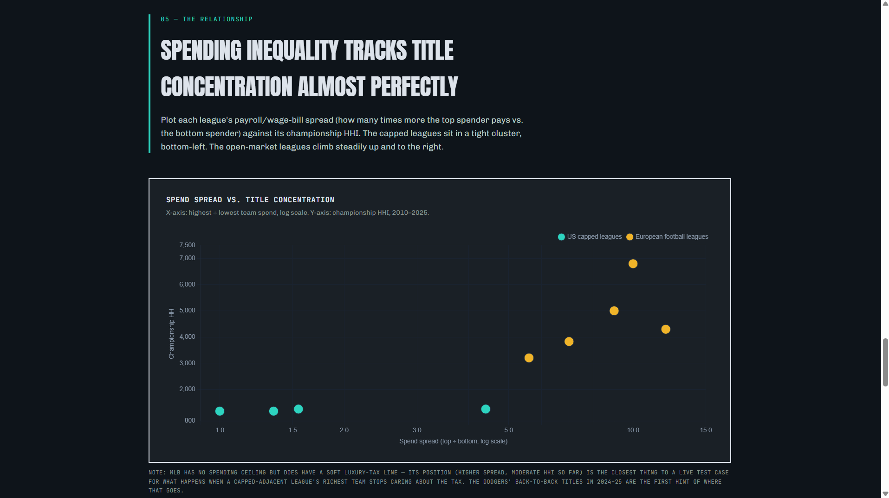

# The Parity Ledger

A data analysis of competitive balance across major sports leagues — the NFL,
NBA, MLB, and NHL versus Europe's top 5 football leagues (Premier League,
La Liga, Bundesliga, Serie A, Ligue 1) — examining how salary caps, luxury
taxes, and revenue sharing shape who actually wins.

**[Live site →](your-github-pages-url-here)** (not ready yet)

## What it covers

Champions for all nine leagues across 16 seasons (2010–2025), each league's
financial structure (hard cap, soft cap, or no cap), team spend spreads, and
championship concentration measured via the Herfindahl-Hirschman Index (HHI) —
the same metric economists use to flag market monopolies, applied here to
trophies.

Capped, revenue-shared US leagues average 10–11 distinct champions out of 16
seasons. Europe's top 5 football leagues average 4.

## My Analysis
This was based on my hypothesis that US sports (NFL, NBA, MLB, NHL) have significantly more parity (ex. more teams with a chance to win) than European soccer leagues because of the salary cap and wealth distribution model. The lower the disparity in financial spending between the top and bottom teams, the more likely you'll have an even league. On top of that, in the US sports you'll regularly see teams from Tampa Bay, Kansas City, Pittsburgh, Milwaukee, Detroit in the playoffs and with a chance to win (in lieu of teams from New York, LA, Chicago). Whereas in Europe, it's only PSG, Bayern, Madrid/Barca, etc... who can win.

From the analysis, which was completed by Claude AI, it's pretty jarring the difference between the US and European sports leagues. Over the past 16 seasons (2010-2025), the US leagues have had an average of 10.5 different champions and the European soccer leagues have had an average of 4. 

And it's pretty jarring how the financial models shape the parity in these leagues. The US leagues all either have a hard cap or some sort of penalty for spending over a certain amount. The NFL has almost perfect spending parity with the hard cap, and they also split TV revenue almost evenly. And in the NFL, you see both (1) the most league parity with the lowest Herfindahl-Hirschman Index (which I'll talk about later), and (2) the best opportunity for small market teams like Kansas City, Tampa Bay, New Orleans, Green Bay, etc... to win. You do see big market teams like Philadelphia, LA, and New England also winning, but they tend to have some competitive edge rather than outspending the rest of the league combined. The NHL also has small market teams winning in lieu of the New York's/LA's/Chicago's, with the last 7 championships won by smaller market teams.

The NFL/NHL/NBA all have been 1x-1.6x spread in spend between the highest and lowest spending teams. The closest we have in the US to European soccer is the MLB with a spread of 4.4x between top and bottom in 2025. Not coincidentally, the MLB doesn't have a salary cap (they have a luxury tax), so the wealthiest owners in New York and LA can spend significantly more than an Oakland (/Las Vegas), for example. You still see small market teams in the MLB with lots of success, but it's harder to sustain it when LA and NY are spending $350M while Oakland spends $75M. The small market owners who don't spend aren't off the hook - you see very stingy owners in places like Pittsburgh, Cincinnati, and even Chicago, but there's also a reason why the Yankees, Red Sox, and Dodgers are World Series favorites most years. Recently the Dodgers have really been taking advantage of the lack of a salary cap, and with the Tarik Skubal signing, their 5 starters might as well be an All Star team's starting rotation. 

There's a pretty stark jump when you get to the European soccer leagues. The Premier League is the closest to the US leagues when it comes to parity and spread between top-and-bottom spend. Man City has consistently spent the most since becoming owned by a Saudi royal, and they've won half of the past 16 Premier League titles. The other winners - Chelsea, Liverpool, Man United - are also among the top spending teams every year. Then there was the one wild year that Leicester City won, but that was one of the most improbable wins ever. They have less than a 6x spread between highest and lowest spenders (which is honestly surprising that it's so low), but even still there is little parity - only 5 different champions in the last 16 years. They also partly share TV revenue rights, which is something to note.

In the other leagues, there is almost total domination by a few teams - the highest spenders. Serie A has Juve, Inter, and AC Milan, with Napoli winning 2 of the last 3. But Juve won 9 titles in a row in this span. The Bundesliga and La Liga have a 10x+ spend gap between their highest and lowest spenders (La Liga is dominated by Barca and Madrid, with Atleti thrown in the mix sometimes, and Bayern has dominated the Bundesliga for the past 2 decades). Then Ligue 1 in France is almost a joke, with PSG probably outspending the entire rest of the league. It's more recent that they've completely dominated, but it's hard to imagine them losing another title race. They could spend 150M EUR on a player who completely busts and not miss a step.

The obvious point of note here is that none of the European soccer leagues have salary caps - I know there are penalties for spending in certain ways, but it doesn't seem to deter teams at all.

### HHI
Claude AI came up with the idea for using the HHI as a measure for league parity. Normally it's used to measure monopoly power, but here it's used for championship parity. And it's a pretty quick calculation: in the case of the Bundesliga, Bayern has won 13 of the last 16 titles, Dortmund 2 and Leverkeusen 1. So the number is (13/16)^2 + (2/16)^2 + (1/16)^2 = 0.6797, times 10,000 = 6,797. That's a very high concentration, whereas the US leagues have a wider range of champions. There are other ways to do this calculation - by win percentage, for example. 

In Economics, the formula is based on market share, where a score of 0 is perfect competition, everybody equally sized, and a score of 10,000 is one firm with 100% market share. In Econ, anything over 1,800 is considered "concentrated" (down from 2,500). 
An example would be airlines - in 2000, the HHI was 1,041, before United, Delta, and American merged with smaller airlines. In 2020, the HHI was 2,041. Wireless communication is even worse, with an HHI of 3,111 in 2015 (very few companies with total control).

The sports comparisons are different because sports operate differently from business markets, but from an economic parity perspective, it gives a good sense. The Bundesliga would be considered almost a pure monopoly, and the US leagues would be considered "moderately concentrated" at around 1,000 - 1,500.

### The Different Financial Models
#### NFL
Is the NFL the most socialistic sport in the world? Strip out the stadium sponsorships and the TV deals with tech conglomerates, the actual product on the field is the most socialistic way to do sports.

National revenue, coming from TV deals and merchandising/licensing, gets split evenly amongst the 32 teams. Local revenue, which includes ticket sales, concessions, and local sponsors goes to the team itself. But something like 60-70% of revenue is split amongst the teams. And there's a salary cap, meaning no team can spend more than another team, regardless of the "value" of that team.

If this were America itself, proposing a 60-70% wealth re-distribution and saying that every company in an industry must spend the same? That would be PURE FULL ON SOCIALISM!!! Never mind that you would get actual competition in a market and the only way to survive would be to out-coach or out-play the other team. Not out-spend year after year. 

America is so funny because it prides itself on pure, unfettered capitalism, but it's happiest with a hard cap on spend in order to preserve parity. It's almost like... those are decisions that can be made.

If American sports were like America, you'd have the Cowboys with an offense led by Josh Allen, Gibbs and Robinson in the backfield, JSN and Justin Jefferson at receiver, Kittle at Tight End. And a defense led by Myles Garrett, Jalen Carter, Micah Parsons, and Pat Surtain. Maybe the Rams get some good players. But the top few teams play against each other every year, and the Bengals and Jaguars fight for scraps. Something with a 10x discrepancy in spend between top and bottom would look something like that.

https://www.acuitymag.com/business/how-the-nfl-created-the-perfect-economic-model
https://www.investopedia.com/articles/personal-finance/062515/how-nfl-makes-money.asp

#### NBA
The NBA operates a bit differently from the other leagues, and kind of in an interesting way. The NBA has a salary cap, but it's not a hard cap (meaning teams can exceed it). First off, a team must spend at least 90% of the salary cap so that players don't get screwed by a tanking owner. Then, for teams who spend more than the salary cap (which was 29 of the 30 teams in 2023-24), there is a luxury tax, a "first apron", and a "second apron". In 2026-27, the salary cap is $165M, the luxury tax comes at $200M, the "first apron" is at $209M, and the "second apron" is at $222M. If a team exceeds the luxury tax, they pay a fine starting at $1.50 per $1 over the limit, and increasing every additional $5M over the luxury tax. This is not insignificant - in 2023-24, the Warriors paid nearly $177M in luxury tax (more than double the salary cap itself). And the league imposes a "repeat offender penalty" if a team has paid the tax in 3 of the past 4 seasons. Half of the money collected by the NBA from this tax goes to the other teams in equal parts. Then comes the "first apron" - this is about $8.5M above the luxury tax limit. If a team exceeds the "first apron", they lose the ability to do certain things (ex. they cannot take in more salary from a trade than they send out). If a team exceeds the "second apron" (about $12.6M above the luxury tax limit), the team starts to really get penalized, including losing the ability to use a Mid-Level Exception, can't send out cash in any trades, and if they break this limit enough, they can start to get penalized draft picks.

This is an interesting model which does lead to quite a bit of parity and not a ton of situations where top teams way overspend the bottom teams. In the NBA, too, I think you get the most parity in big market vs. small market teams, where this past season you had teams like Detroit, Cleveland, Orlando, Oklahoma City, San Antonio, Denver, and Minnesota joined by the likes of Boston, New York, Philadelphia, LA, and Houston. The NBA suffers more from tanking from the bottom teams than anything else. It does seem like a fully win-now team could just break the bank and suffer the consequences, but overall it seems to do a good job of keeping parity and rewarding good coaching and successful drafting. You do see superteams, but it does generally mean that they need to sacrifice on depth.

https://www.sportico.com/feature/nba-salaries-explained-salary-cap-1234786618/
Google AI answers

#### MLB
Major League Baseball is the only major American sports league without a salary cap and salary floor. It also has by far the biggest disparity between highest and lowest payroll (though still not close to European soccer).

In place of a salary cap, MLB uses a Competitive Balance Tax (CBT). Teams can spend as much as they want, but they are penalized at progressively increasing rates if they exceed a certain amount (something to do with the average value of all player contracts on their roster). Teams above the base limit for multiple years in a row also face an increasing luxury tax each year. And, exceeding the limit by massive amounts can result in a team's draft spot being dropped several spots.

MLB also has a "market score" based on local population size, so team's from major markets actually don't receive revenue sharing money from CBT overages.

Baseball has revenue sharing, where about 50% of local TV and ticket revenue is shared with the rest of the league.

Interestingly, a salary cap/floor is being proposed in the MLB for 2027. 

The MLB is notorious for what's called "Moneyball", where smaller market teams who couldn't outspend the NY's/Boston's/LA's would find undervalued players using advanced metrics. 

But, in general, the largest market teams like the Dodgers, Yankees, and Red Sox tend to be among the best every year, and spending correlates pretty closely with on-field performance. The Dodgers have also been somewhat cute with the system, structuring massive contracts like Shohei Ohtani's to pay relatively little now, and giving humongous payments 10 years from now. You do have smaller market teams like Tampa Bay and Milwaukee at the tops of their divisions, but the Yankees, Red Sox, Dodgers, Astros (recently), and Braves are almost always at the top. While Cincinnati, Pittsburgh, Kansas City, and Colorado live towards the bottom. Kansas City in 2015 was the last of the "small market" teams to win the championship.

Baseball does still have quite a few small market teams doing well, but year-after-year it will be almost impossible to take down the Dodgers.

https://www.mlb.com/news/mlb-proposed-salary-cap-floor-system
https://en.wikipedia.org/wiki/Major_League_Baseball_luxury_tax
https://www.reddit.com/r/baseball/comments/1ilrprl/how_the_nba_and_nfls_salary_cap_salary_floor/

#### NHL
NHL is the one I know the least about, but seems to be about the fairest (in terms of top-to-bottom spend). And it makes sense since the last few champions have been Tampa Bay, Florida (Panthers), and Vegas. The NHL has a hard cap and a salary floor - this year (2026-2027), the salary cap is ~$104m and the floor is ~$77m. And then they have revenue sharing, where the top-earning teams "contribute" to the shared pot, and the bottom-earning teams are "takers". The players also share 50% of the hockey-related revenue with the owners. The teams which tend to win are at the top of league spending (Vegas, Toronto, Dallas, Florida, Washington, Colorado, Minnesota), but it's all within a cap/floor.

Also, it almost seems like big/small market plays no role in hockey. NY, LA, Chicago seem no more likely to win than Buffalo, Winnipeg, Carolina.

https://www.eliteprospects.com/page/nhl-salary-cap-explained
https://rg.org/en-ca/guides/championship-guides/nhl-salary-cap-explained-canada-guide

## Future Updates
<!-- - Further define HHI -->
- Research the financial models further of each sport
- Incorporate the fact that, for example, in baseball, they structure salaries creatively so as to pay as little as possible now but with massive payouts later. For now, the opening-day payroll makes sense.
- plot out record with payroll by sport to see correlation with winning (may be a different type of analysis). indicate big/small market
- "star power" analysis - how much does have a star player make a difference in results. In MLB, likely not as much. In NBA, a huge amount.
- championship analysis - likelihood a non-1 seed will win the title

## Data & methodology

Champion records and financial figures verified against league sources and
current reporting as of August 2026. Full methodology and caveats are in the
site itself — see the "Methodology & Caveats" section.

## Stack

Plain HTML/CSS/JS, Chart.js (bundled locally, no CDN dependency), data kept
in a separate `data.js` for easy verification against sources. Visual design
explored with Google Stitch, hand-implemented into the existing CSS system.

## Running locally

Just open `index.html` in a browser — no build step, no dependencies to
install.